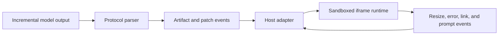

# VelarOS HTML Artifacts

[](https://github.com/Error-Zhang/VelarOS-HTML-Artifacts/actions/workflows/ci.yml)
[](./LICENSE)

A dependency-light TypeScript library for turning incremental model output into live, sandboxed HTML artifacts.

It contains two deliberately separate layers:

- A streaming protocol parser that emits renderer-neutral artifact and patch events.
- A sandbox runtime that builds iframe documents, applies HTML/CSS/JavaScript patches, reports runtime failures, measures natural content size, and hands host actions back through `postMessage`.

The project was designed and built by [Error-Zhang](https://github.com/Error-Zhang) as part of VelarOS Desktop, then separated behind a public, host-agnostic boundary. The original commit history is preserved.

[中文文档](./README.zh-CN.md)

## Why this exists

Streaming HTML is not the same as assigning partial text to `innerHTML`. A model can stop in the middle of a tag, CSS rule, script, or UTF-8 payload. At the same time, the host must keep untrusted output isolated, avoid transcript layout oscillation, and preserve a useful error trail.

VelarOS HTML Artifacts handles those seams without depending on React, Electron, an agent loop, or a particular model provider.



## Install

Until the first npm publication, pin the GitHub repository or a release commit:

```bash
npm install github:Error-Zhang/VelarOS-HTML-Artifacts
```

The compiled `dist/` directory is versioned so Git dependencies also work in package managers that do not run dependency `prepare` scripts.

The npm package name is reserved in the manifest as `@velaros/html-artifacts`.

## Protocol parser

```ts
import {
  applyHtmlArtifactProtocolChunk,
  createHtmlArtifactProtocolStreamState,
  finalizeHtmlArtifactProtocol,
} from '@velaros/html-artifacts/protocol'

const state = createHtmlArtifactProtocolStreamState({ enabled: true })

for await (const chunk of modelTextStream) {
  const events = applyHtmlArtifactProtocolChunk(state, chunk)
  for (const event of events) renderEvent(event)
}

for (const event of finalizeHtmlArtifactProtocol(state)) {
  renderEvent(event)
}
```

The v1 wire format is intentionally small:

```html
<artifact version="1" id="profile-card" title="Profile card">
  <patch type="replace"><main id="app"></main></patch>
  <patch type="append" target="#app"><h1>Hello</h1></patch>
  <patch type="style" id="base">#app { padding: 24px; }</patch>
  <patch type="script" id="boot">console.log('ready')</patch>
</artifact>
```

The parser emits HTML only at closed-element boundaries, CSS only at complete rule boundaries, and scripts only after their patch closes. Use `encoding="base64"` when a payload itself contains protocol closing tags.

## Sandboxed runtime

```ts
import {
  buildHtmlArtifactShellDocument,
  normalizeHtmlArtifactExternalUrl,
  resolveHtmlArtifactFrameFit,
} from '@velaros/html-artifacts/runtime'

const iframe = document.createElement('iframe')
iframe.setAttribute('sandbox', 'allow-scripts')
iframe.srcdoc = buildHtmlArtifactShellDocument()

const safeUrl = normalizeHtmlArtifactExternalUrl(candidateUrl)
const fit = resolveHtmlArtifactFrameFit({
  fallbackHeight: 360,
  maxViewportWidth: 720,
  naturalHeight: 900,
  naturalWidth: 1200,
})
```

The host owns the iframe sandbox attribute and must validate both `event.source` and every message payload. The runtime's default link policy accepts only explicit HTTP and HTTPS URLs.

## Design boundaries

This repository owns reusable mechanics, not product policy. It intentionally excludes:

- model system prompts and tool-selection instructions;
- chat state, persistence, retry policy, or agent orchestration;
- Electron IPC and Desktop-specific events;
- theme tokens, toolbars, fullscreen layers, or other product UI;
- Widget, memory, permission, or VelarOS Kernel implementation details.

Hosts can provide their own bridge message names, CSS, root id, sandbox policy, and UI adapter.

## Development

```bash
npm install
npm run check
npm run demo
```

`npm run check` runs type checking, the Node test suite, a production demo build, and a package dry run.

## Release model

The public repository is the source of truth. VelarOS Desktop consumes an exact released commit or package version; Desktop-specific adapters remain private. Generic fixes land here first, then flow downstream through a dependency update.

## Security

Generated HTML is untrusted input. Read [SECURITY.md](./SECURITY.md) before changing sandbox, script, URL, or bridge behavior.

## License

MIT © 2026 Error-Zhang
